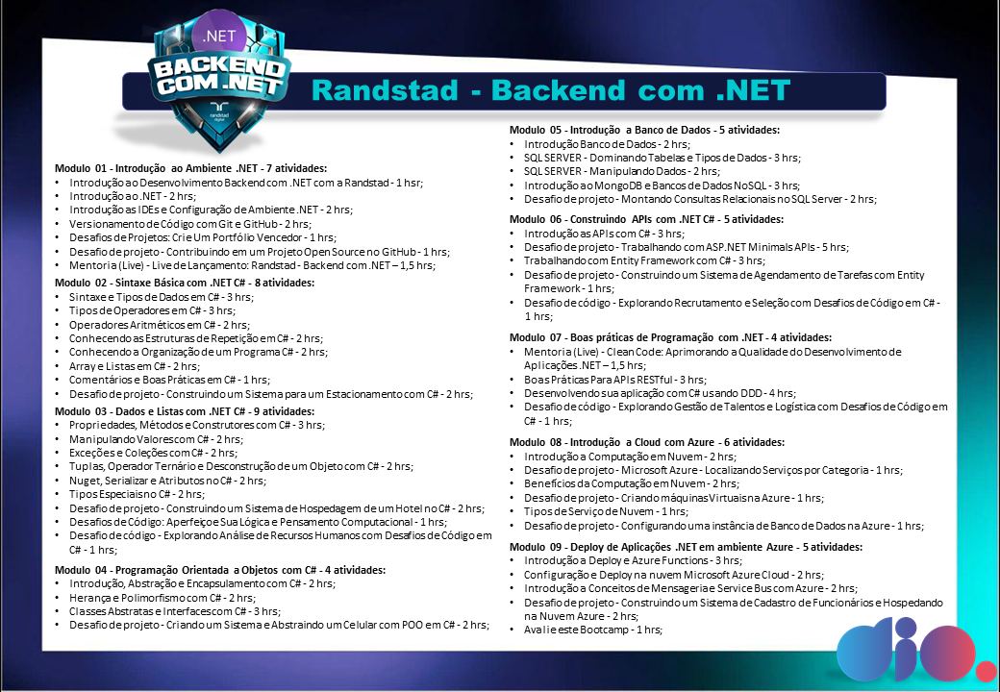

# BootCamp Randstad - Backend com .NET - DIO

Programa intensivo focado em C#, .NET, banco de dados e boas práticas de programação. Abrange tópicos como APIs RESTful, Azure, POO e deploy de aplicações, proporcionando habilidades práticas em desenvolvimento backend.

Segue também contracapa que criei com todos os cursos e módulos deste bootcamp para ser impresso na parte de tras do seu certificado!

# Desafios de Código

## 1.1 - Contando Funcionários por Departamento

> Descrição: Você precisa desenvolver um sistema que conte o número de funcionários em cada departamento. Dada uma lista que representa o departamento de cada funcionário, seu objetivo é calcular a quantidade de funcionários em cada departamento e apresentar esse número.

- Entrada: A entrada é uma string onde cada valor, separado por vírgulas, representa o nome do departamento ao qual um funcionário pertence.

- Saída: Deverá retornar os nomes dos departamentos em ordem alfabética seguidos pela contagem de funcionários em cada departamento, um por linha.

- Exemplos: A tabela abaixo apresenta exemplos com alguns dados de entrada e suas respectivas saídas esperadas. Certifique-se de testar seu programa com esses exemplos e com outros casos possíveis.
- Entrada: TI,RH,TI,Financeiro
- Saída: Financeiro: 1 / RH: 1 / TI: 2

## 1.2 - Avaliando o Desempenho Anual dos Funcionários

> Descrição: Uma empresa realiza uma avaliação anual de desempenho de seus funcionários, utilizando três critérios principais: produtividade, qualidade do trabalho e pontualidade. Cada critério recebe uma nota que varia de 0 a 10. O objetivo do sistema é calcular a média das notas e determinar se o funcionário é elegível para receber um bônus anual.\
> Para ser elegível ao bônus, o funcionário precisa obter uma média igual ou superior a 7,0.

- Entrada: Você receberá uma string contendo três valores inteiros separados por vírgula (,). Esses valores representam as notas atribuídas a cada critério, na seguinte ordem: Produtividade / Qualidade do Trabalho / Pontualidade

- Saída: O programa deve imprimir duas linhas:\
  A primeira linha deve mostrar a média das três notas, formatada com duas casas decimais.\
  A segunda linha deve informar se o funcionário é elegível para o bônus, exibindo Sim ou Nao.\

- Entrada: 8,7,9
  Saída: Media: 8 / Elegivel para bonus: Sim

## 1.3 - Calculando a Folha de Pagamento

Descrição: Você foi contratado para desenvolver uma aplicação que automatize o cálculo da folha de pagamento de uma empresa. A aplicação deve considerar o salário base do funcionário, as horas extras trabalhadas e descontos, como imposto de renda e contribuição previdenciária. O objetivo é calcular o salário líquido de cada funcionário ao final do mês.\
Para o cálculo considere a fórmula:\
Salário Líquido = Salário Base + (Horas Extras Trabalhadas \* Valor por Hora Extra) - Desconto de Imposto de Renda - Desconto de Contribuição Previdenciária

- Entrada: A entrada é uma string representando uma lista com cinco valores numéricos separados por vírgula (,), na seguinte ordem:\
  Salário base (um valor decimal que representa o salário fixo do funcionário).\
  Horas extras trabalhadas (um valor inteiro que indica o número de horas extras realizadas pelo funcionário).\
  Valor por hora extra (um valor decimal que representa quanto o funcionário ganha por hora extra trabalhada).\
  Desconto de imposto de renda (um valor decimal que representa o valor do imposto a ser descontado do salário).\
  Desconto de contribuição previdenciária (um valor decimal que representa a contribuição previdenciária a ser descontada).

- Saída: A saída deverá retornar o salário líquido do funcionário com duas casas decimais.

- Entrada: 2500, 0, 50, 250, 150
- Saída: 2100.00

## 2.1 - Classificando Currículos

> Descrição: Você é responsável por auxiliar o departamento de recursos humanos de uma empresa a categorizar currículos de candidatos com base na experiência profissional. Seu desafio é criar um sistema que, ao receber uma lista de anos de experiência, classifique cada currículo como "Junior", "Pleno" ou "Senior".\
> “Junior”: Candidatos com até 3 anos de experiência.\
> “Pleno”: Candidatos com mais de 3 e até 5 anos de experiência.\
> “Senior”: Candidatos com mais de 5 anos de experiência.

- Entrada: A entrada deve receber uma string representando uma lista de números inteiros separados por vírgulas, representando os anos de experiência de cada candidato.

- Saída: Deverá retornar uma lista de classificações ("Junior", "Pleno" ou "Senior") correspondente a cada valor de entrada, também separada por vírgulas.\
  A saída deve manter a ordem dos currículos conforme a entrada.

- Entrada: 2,4,8,6
- Saída: Junior, Pleno, Senior, Senior

## 2.2 - Filtrando Currículos por Palavras-chave

> Descrição: Desenvolva um sistema que filtre currículos com base em palavras-chave fornecidas. O sistema deve analisar uma lista de currículos e identificar quais currículos contêm todas as palavras-chave especificadas. Um currículo é considerado relevante apenas se contiver todas as palavras-chave fornecidas. Se nenhum currículo atender a todos os critérios, o sistema deve informar que nenhum currículo foi encontrado.

- Entrada: A entrada consiste em uma única linha contendo duas partes separadas por um ponto e vírgula (;):\
  Uma lista de currículos, onde cada currículo é uma string separada por vírgula (,).\
  Uma lista de palavras-chave, onde cada palavra-chave é uma string separada por vírgula (,).\

- Saída: O sistema deve retornar uma lista de currículos que contenham todas as palavras-chave especificadas.

- Se nenhum currículo atender a todos os critérios, o sistema deve retornar "Nenhum curriculo encontrado".\
  Os currículos relevantes devem ser apresentados em uma única string, separados por ponto e vírgula (;).

- Entrada: Analista de Dados, Gerente de Projetos; dados, analista
- Saída: Analista de Dados

## 2.3 - Sistema de Pontuação de Candidatos

> Descrição: Desenvolva um sistema para avaliar candidatos com base em múltiplos critérios de pontuação. Cada critério possui um peso específico que determina a importância relativa do critério na pontuação total do candidato. O sistema deve calcular a pontuação total para cada candidato, considerando os pesos dos critérios fornecidos, e retornar o nome do candidato com a maior pontuação total precedido pela palavra "Candidato".

- Entrada: A entrada é composta pelos seguintes valores:\
  Pesos dos Critérios: Uma string representando uma lista de pesos para cada critério, separados por vírgula.\
  Quantidade de Candidatos: Um número inteiro representando a quantidade de candidatos.\
  Dados dos Candidatos: Para cada candidato, uma string que contém:\
  O nome do candidato.\
  Uma lista de pontuações para cada critério, separados por vírgula.\
  Cada linha subsequente após a quantidade de candidatos contém essas informações para um candidato.

- Saída: O sistema deve retornar o nome do candidato com a maior pontuação total, precedido pela palavra "Candidato".\
  A pontuação total de um candidato é calculada como a soma do produto de cada pontuação pelo seu peso correspondente.

- Entrada: 0.6, 0.5 / 2 / A, 80, 90 / B, 90, 60
- Saída: Candidato A

## 3.1 - Alocação de Recursos de Treinamento

> Descrição: Desenvolva um algoritmo que otimize a alocação de recursos para treinamentos. O programa deve receber o orçamento total disponível e uma lista de custos de treinamentos, e retornar a combinação que maximize o número de treinamentos sem exceder o orçamento. Se houver múltiplas combinações possíveis com a mesma quantidade de treinamentos, o programa deve selecionar a combinação que tenha o menor custo total.

- Entrada: A entrada é composta por duas linhas, sendo a primeira um número inteiro representando o orçamento, e a segunda uma lista de números inteiros separados por vírgula representando os custos dos treinamentos.

- Saída: A saída deve ser uma lista de números inteiros separados por vírgula, representando os custos dos treinamentos selecionados. A lista deve conter a maior quantidade possível de treinamentos sem exceder o orçamento. Se houver várias combinações com a mesma quantidade de treinamentos, retorne aquela que tem o menor valor total.

- Entrada: 1000 / 300,400,200,350
- Saída: 200,300,350

## 3.2 - Reagendando os Horários das Entrevistas

> Descrição: Você é responsável por organizar a agenda de entrevistas de candidatos para evitar conflitos de horários. Cada candidato tem um horário agendado, e você deve reorganizar as entrevistas de forma que nenhum horário se sobreponha, garantindo que todos os candidatos sejam entrevistados. A saída deve mostrar o nome do candidato junto com o horário ajustado da entrevista.

- Entrada: A entrada é uma string onde cada linha representa uma lista de candidatos com seus nomes e horários agendados.

- Saída: Uma lista com os horários das entrevistas organizados, de modo que não haja conflitos de horários, respeitando a ordem cronológica.\
  Se necessário, ajuste os horários de início das entrevistas para garantir que todos os candidatos possam ser entrevistados sem sobreposição.\
  Cada entrada na lista de saída deve mostrar o nome do candidato e o horário ajustado.

- Entrada: Tiago, 09:00-10:00 / Ricardo, 09:30-10:30
- Saída: Tiago, 09:00-10:00 / Ricardo, 10:00-11:00

## 3.3 - Gerenciamento de Trabalho Temporário

> Descrição: O departamento de RH de uma empresa precisa de um sistema para gerenciar contratos de trabalho temporário durante períodos de alta demanda. Desenvolva um programa que ajude a calcular o custo total dos contratos temporários, determine se o orçamento foi excedido e identifique os departamentos que mais utilizam mão de obra temporária.\
> O programa deve processar uma lista de contratos temporários, cada um contendo o nome do funcionário, o departamento, o número de dias de trabalho e o valor da diária. Além disso, o sistema deve considerar um orçamento pré-definido para trabalho temporário.

- Entrada: A entrada consistirá em duas linhas:\
  Um número representando o orçamento total para trabalho temporário.\
  Uma string contendo informações sobre os contratos temporários no formato: "nome,departamento,dias,valor_diaria", separados por ponto e vírgula.

- Saída: O programa deve retornar três linhas:\
  O custo total dos contratos temporários (com duas casas decimais).\
  "Orcamento excedido" se o custo total for maior que o orçamento, ou "Dentro do orcamento" caso contrário.
  O nome do departamento que mais utilizou mão de obra temporária (em termos de custo total).

- Entrada: 25000 / Luiz,TI,30,200;Ana,Vendas,45,180;Caio,TI,20,220;Luna,RH,15,190
- Saída: 21350.00 / Dentro do orcamento / TI
