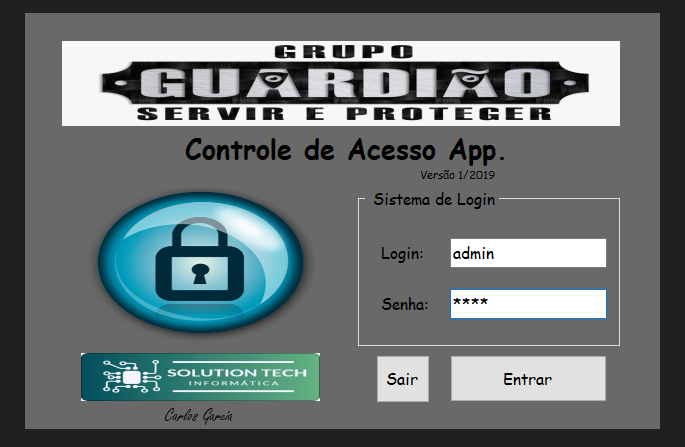
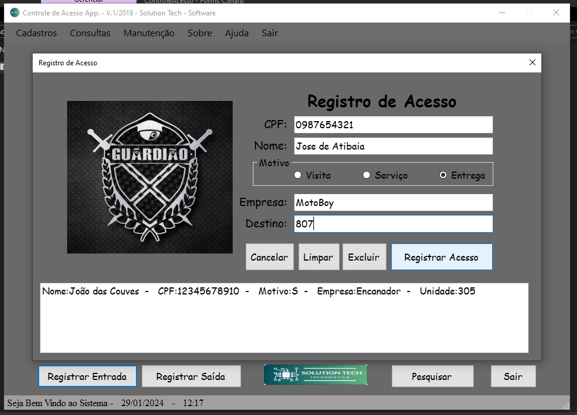

# Aplicativo de controle de acesso - Utilizando o Windows Forms 

### Criei esse aplicativo utilizando o forms no visual studio community do zero.
### Esse aplicativo foi desenvolvido utilizando o windows forms para rodar em ambiente windos e utilizando a linguagem C#.
 -  Login: admin / Senha: 2013 
 - Este foi meu primeiro aplicativo Forms desenvolvido, por isso me desculpem os erros de código e desacordos com as boas práticas de desenvolvimento de software. 
 - Na época minha intenção era apenas fazer o aplictivo funcionar, pois criei ele em 2019, e resolvi postar-lo aqui no meu GitHub apenas para compartilhar.
 - Antes de iniciar ele apresenta uma tela splash de carregamento e interatividade com botões.
 - O aplicativo esta com algumas funcionalidades de buscas incompletas, assim como alguns botões
 - Porém faz o registro estático de visitantes enquanto o app está aberto conforme prints de tela abaixo:

